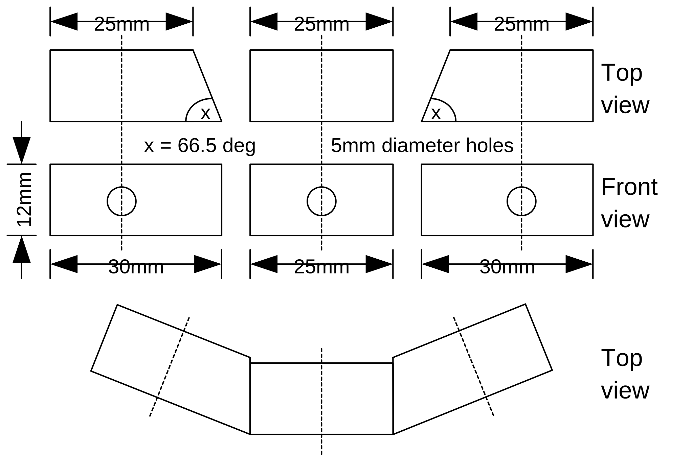

# Make the light sensor bar.

Using 12mm square pine, cut three pieces as follows:

1 x rectangle 25mm long for the middle.  Drill a 5mm hole in the middle.
2 x sides.  For each side, the back is 25mm long, the front 30mm long.  Drill a 5mm hole in the middle of the shorter side (i.e. from the back). 
The 5mm holes should be square to the wood.

Place the parts on a piece of balsawood and glue in place.

Trim the balsawood.

Colour in the holes with black marker pen so that the holes are dark.

Solder a 30cm length of wire to one leg on each of the LDRs and cover with heatshrink.

From the front, pull an LDR half way in each hole and glue in place.  Make sure the LDRs are square in the hole.  If they are tight, press then in with the blunt end of the 5mm drill bit.

Solder the remaining connection on each LDR together and connect a black ground wire.

Colour in the front, top and sides of the LDR with a black marker pen.

